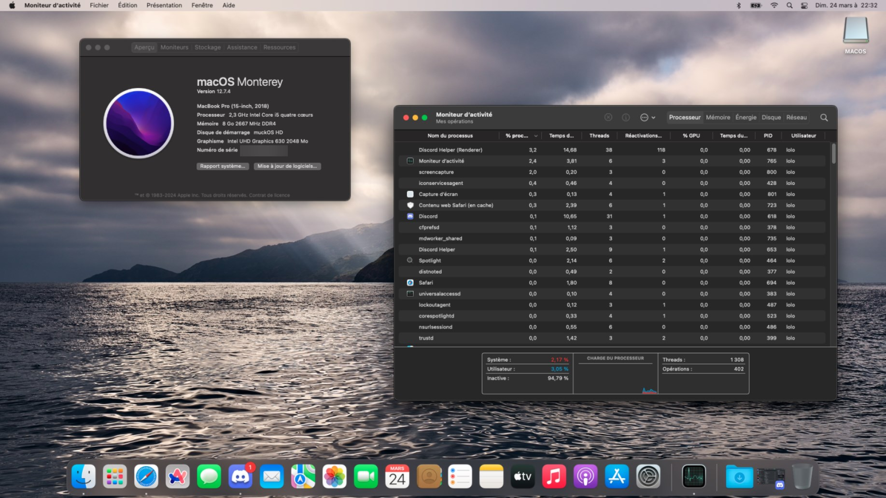

<!-- made by ItzBenoitXD with the help of BlueprintFramework's README -->
<!-- Header -->
 

  <picture>
      
  </picture>
  # Hackintosh Project for Asus Tuf Gaming FX705GD
   
  very legal way of bringing macOS Monterey (or any version for that manner) to your ASUS TUF GAMING FX705GD laptop
    

<!-- Disclaimer -->
 <h2 align="center">⚠️ Disclaimer ⚠️</h2>

This EFI will only work for the **Asus Tuf Gaming FX705GD** laptop **ONLY**. The reason I'm sharing this EFI is because it works on my machine.

Attempting to use this EFI on your Asus Tuf Gaming FX705GD (or any laptop for that matter) can lead to an unstable system, and unexpected issues may occur. I take no responsibility for any damage, data loss, or malfunction caused by the use of this project. Proceed at your own risk.

For legal reasons, the releases will only contain the EFI for this Hackintosh, and not the macOS Installer files. You can grab them at Dortania's Guide however.

<!-- Showcase -->
 <h2 align="center">📷 Showcase</h2>

<!-- Version Info -->
 <h2 align="center">⌨️ Version Info</h2>

| V.I.       | Type                                           |
| --------------- | ------------------------------------------------ |
| OC Version             | OC 0.9.8             |
| MacOS supported            | Tested with Monterey           |
| Status           | some broken stuff lol      

<!-- Components & Compatibility -->
 <h2 align="center">💻 Components and Compatibility</h2>

 <h3 align="center">⚠️ Warning ⚠️</h3>
Don't forget to map your USB ports with something such as USBMap to make sure Bluetooth, webcam, and USB ports are correctly working.
Don't forget to also generate a SMBIOS and putting the correct values according to it in the config.plist. The system probably won't boot without you doing that.

- ✅ - Works as intended, tested
- ⚠️ - In development, or fix in progress
- ❌ - Broken, may be fixed
- ⛔ - Incompatible, won't be fixed

| Component       | Model                                           | Status             | Explanation             |
| --------------- | ------------------------------------------------ | --------------- | ---------------          |
| `CPU`             | Intel Core i5-8300H (Coffee Lake)             | ✅             | Just works 🥶 |
| `GPU`             | NVIDIA Mobile 1050Ti                        | ⛔             | Broken, no macOS drivers for NVIDIA GPUs since macOS High Sierra :( |
| `eGPU`            | Intel Graphics UHD 630                       | ✅             | Works normally |
| `Audio`           | Realtek ALC233                                | ✅             | Works normally |
| `Ethernet`        | Realtek RTL8168/8111                         | ✅             | Works normally |
| `Wi-Fi`          | Intel Wireless-AC 9560                  | ⚠️ | Works, but might have quirks. itlwm kexts are still experimental. | 
| `Bluetooth`      | Intel Bluetooth                              | ⚠️ | Works, but might have quirks. Bluetooth support is very finnicky, and some devices might **not work at ALL**. | 
| `Touchpad`       | Trackpad ELAN1200 I2C-HID                    | ✅             | Works normally | 
| `Keyboard`       | Keyboard PS2                                 | ⚠️             | Works normally, but backlight and FN keys are half broken. | 
| `Battery`        | Asus Default Battery                         | ✅             | Works normally | 
| `Webcam`         | USB2.0 HD UVC WebCam Internal                                              | ✅             | Works normally | 
| `Microphone`     | Realtek micwopon                                            | ✅             | Works normally | 
| `USB Ports`     | 3 USB 2.0, 2 USB 3.1                                         | ✅             | Works, don't forget to map your USB ports | 
| `Fans`           | 2 Fans                                              | ⚠️             | Works fine ofcourse, but fan control or speed readings don't work. |

| Function       | Status             | Explanation |  
| --------------- | --------------- | --------------- |
| `Sleep/Wake/Shutdown`  | ✅             | Works perfectly fine. |
| `AirDrop`  | ⚠️             | Works at times, depends of the iDevice you are trying to AirDrop with (Bluetooth is finnicky) |
| `FaceTime/iMessage`  | ✅             | Personally for me it works, might not work for you, random lmao |
| `AirPlay`  | ✅             | Works too thanks to the WiFi compatibility (even tho it might break sometimes) |

 <h3 align="center">ℹ️ Info about components with compatibility issues</h3>

<h3 align="center">GPU</h3>

#### Support for the eGPU of this laptop will never be here due to the simple fact that Apple has stopped releasing NVIDIA drivers altogether as macOS High Sierra released.

<h3 align="center">Wi-Fi/Bluetooth</h3>

#### WiFi and Bluetooth on macOS Monterey with Intel cards is very finnicky due to the fact that Intel hasn't released official drivers for macOS, so it's purely based on Community Support. Due to that fact, drivers exists, but they aren't at this top level that you'll get support for everything such as AirDrop, or AirPlay perfectly. It might work fine, or not. I would recommend investing in a supported WiFi chipset and Bluetooth dongle if you really want that functionality.

<h3 align="center">Keyboard</h3>

#### Although the keyboard itself works, the main issues are with FN keys mapping and Keyboard backlight (especially after waking up from sleep).

<h3 align="center">Fans</h3>

#### Fans will work normally but however, you won't be able to get speed readings at all or control them within macOS.

<!-- TO-DO List -->
 <h2 align="center">✅ To-Do</h2>

This section has moved to my GitHub's Project tab of this project. You can view it by **clicking [here](https://github.com/users/Lolo280374/projects/2/views/1?layout=board).**

<!-- Stargazers -->
 <h2 align="center">🌟 Stargazers</h2>

<a href="https://github.com/Lolo280374/Hackintosh-TUFGAMING-FX705GD/stargazers">
  <picture>
    <source media="(prefers-color-scheme: light)" srcset="http://reporoster.com/stars/Lolo280374/Hackintosh-TUFGAMING-FX705GD">
    
  </picture>
</a>

<!-- Credits -->
 <h2 align="center">💖 Credits/Sources</h2>

This repository couldn't be possible all to theses amazing people's projects and contributions to the Hackintosh scene and this project:
- [**ItzBenoitXD**](https://github.com/ItzBenoitXD) - he made the readme!!41!!1!1!1
- [Dortania](https://dortania.github.io/) - For good guides such as Installing OpenCore, debugging, and the Buyer's Guide.
- [Acidathera](https://github.com/acidanthera) - For OC and Kexts.
- [RehabMan](https://github.com/RehabMan) - for ACPI Patching.
- [doanhxd](https://github.com/doanhxd/Asus-TUF-Gaming-FX505GE-Hackintosh) - I used this EFI as the baseline of this Hackintosh. This EFI would have never been possible without him! :D
- [DotCube123](https://github.com/DotCube123/Asus-Tuf-Gaming-FX705GE-Hackintosh) - I used this EFI for reference with newer macOS versions and to fix some issues in the base EFI.
- The Hackintosh community - for helping me with debugging this hackintosh.

<!-- Related Links -->
 <h2 align="center">🔗 Related Links</h2>

[**Dortania's Installation Guide**](https://dortania.github.io/OpenCore-Install-Guide/): the go-to guide for how to Hackintosh and how to fix most of your errors.\
[**Dortania's Buyers Guides**](https://dortania.github.io/getting-started/): useful guides to know which dongles/external devices to buy to give your Hackintosh more compatibility!\
[**Reddit**](https://www.reddit.com/r/hackintosh/): the Hackintosh community in reddit, perfect place for quick answers on any errors you could experience during this adventure!
